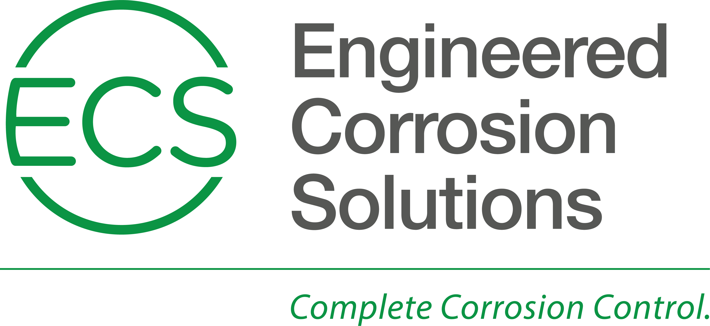

# Engineered Corrosion Solutions

## About
We’re in the risk management business. With our help, our clients keep their fire sprinkler systems safe. Whether it’s a risk to lives, structures, properties, or everyday business, we guide clients to the best answer for their safety. Corrosion is our enemy and safety is our goal. To accomplish that goal, we’ve come to understand why and how corrosion happens. There’s no one-size-fits-all solution because a truly cost-effective combination of devices, systems, and management approaches depends on your individual needs. And we never stop finding new and better ways to serve those needs. Being the first hasn’t made us the best—working the hardest for the longest has.

## Contact
11336 Lackland Rd.
St. Louis, MO 63146
+1 (314) 432-1377
